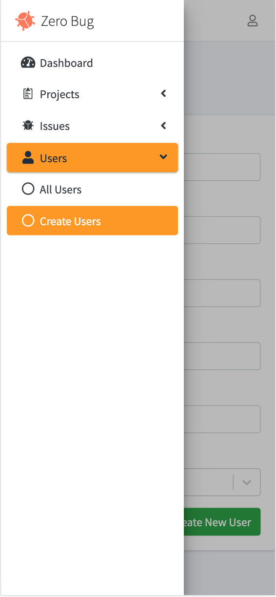
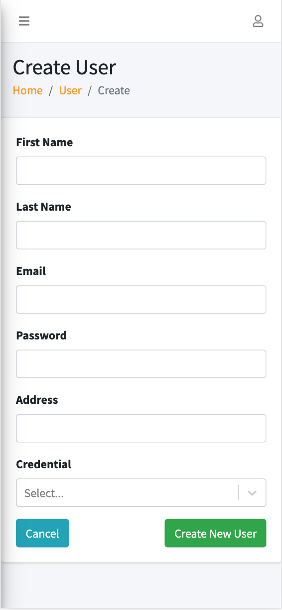

# Zero Bug - Project Management and Bug Tracking App 

## <a href="https://zerobug.herokuapp.com/">LIVE DEMO</a>

*For demo please log in with email: admin@admin.com , password: admin*

## Introduction
Bug Tracking System must be in place for every infrastructure we design. Software is no exception to this. This application is designed to track the status of bugs that are reported during Software testing.

## Screenshot 
### Welcome Screen

### Landing Page

### Dashboard 

### Mobile View 

### Database Schema

### Usecase Diagram 

## Future Implementation 
The first feature I would love to add is a messenger for all users to contact with each other. 
I also would like to add a new feed and a notification system using GraphQL subscription.

## Build With 

<ul>
    <li>GraphQL</li>
    <li>AdminLTE Template</li>
    <li>MongoDB Atlas</li>
    <li>FontAwesome Icons</li>
    <li>Bootstrap</li>  
</ul>

