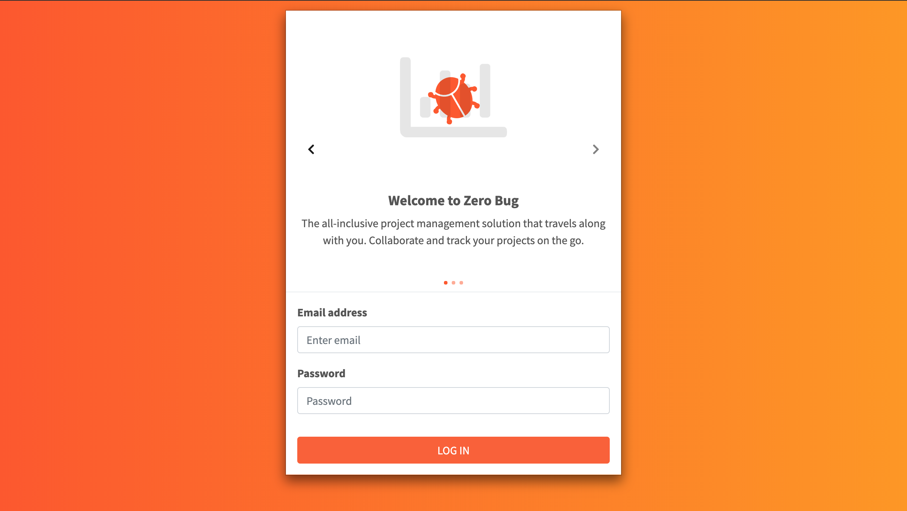
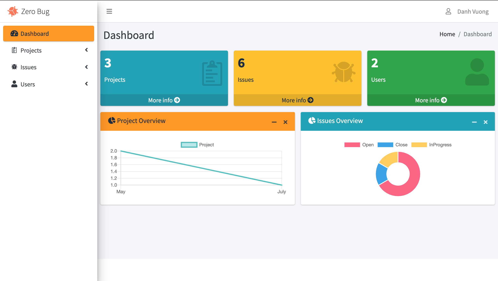
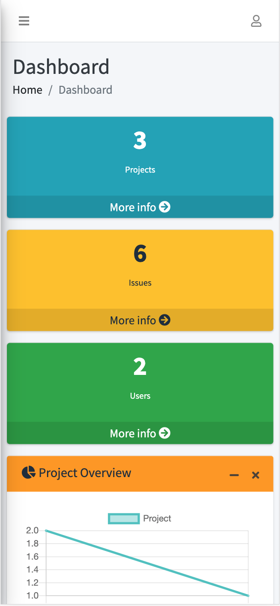

# Zero Bug - Project Management and Bug Tracking App 

<a href="https://zerobug.herokuapp.com/">LIVE DEMO</a>

*For demo please log in with email: admin@admin.com , password: admin*

## Introduction
Bug Tracking System must be in place for every infrastructure we design. Software is no exception to this. This application is designed to track the status of bugs that are reported during Software testing.

## Screenshot 
### Landing Page

### Dashboard 

### Mobile View 

